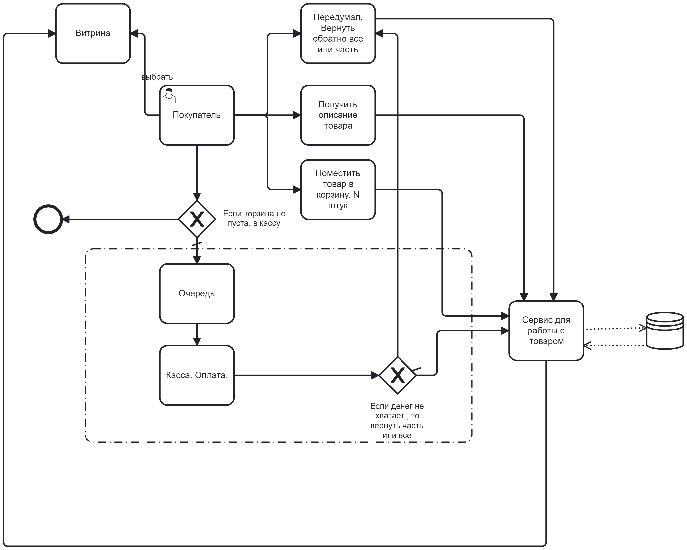
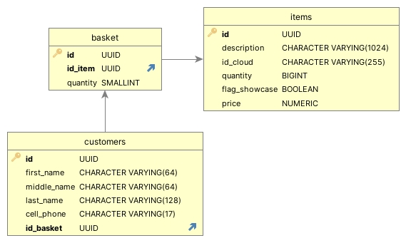

# OnlineShop
Как-то в качестве тестовой задачи предложили создать архитектуру онлайн-магазина при распродаже. Сгоряча что-то такое нарисовал, а минут 15 спустя, призадумался. Не все так уж все просто. На досуге решил набросать.

Учитываем, что работает не одна касса, но несколько. Кассы разворачиваем в разных докерах. К каждой м.б. очередь. Для прома потребуется еще Kafka, Rabbit etc (?)

Получаем следующие основные сущности:
 - Товар 
 - Покупатель
 - Корзина

Применяем след. стэк: 
 - Java 17
 - Spring Boot 3.5.0-RC1
 - WebSocket
 - Swagger
 - PostgreSql
 - Docker version 28.0.4
 - Maven
 - Liquibase
